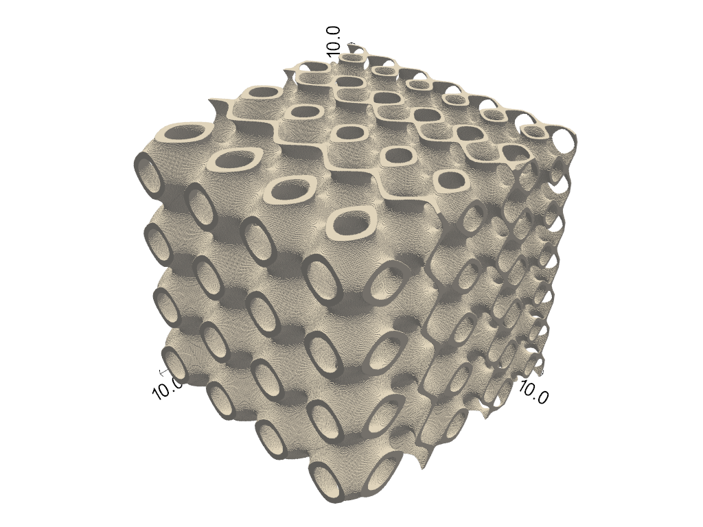

# Summary

LisbonTPMS-tool is a Python package designed for generating triply periodic minimal surface (TPMS) structures for applications in 3D modeling, printing, and finite element (FE) analysis.

TPMS are mathematical surfaces characterized by periodic, non-self-intersecting structures with zero mean curvature. These surfaces occur naturally in various biological and physical systems and have attracted significant attention due to their unique structural properties. With the growing interest in TPMS structures, this tool provides a versatile and user-friendly solution for creating and manipulating these geometries. Their geometry can be precisely controlled and tailored for specific applications, making them highly valuable in fields such as biomedical engineering, materials science, and mechanical design.

# Instalation

After creating a Python working environment, LisbonTPMS-tool can be installed directly from GitHub, using pip and:

(1) Directly from source

pip install git+https://github.com/JorgeESantos/LisbonTPMS-tool.git

# Structure, dependencies and features

The code has been minimalised to a main Class named TPMS with methods for calculating cell-size configuration, level-set volume generation, and a visualisation tool. Apart from that, there are four code modules: one of utility functions mainly oriented for image creation and gradient arrays generation, another for image manipulation, segmentation and visualization, another for surface/triangular mesh generation and processing, and another for FE volume mesh generation and export.

The code is mainly dependent on NumPy [1], Scipy [2], scikit-image [3], PoreSpy [4] and PyVista [5].

The default TPMS structures are present in the Surfaces.py module, with all their respective mathematical equations defined and stored in a dictionary (surfaces_dict), to be indexed by the main Class. This structure allows users to easily add more TPMS structures if desired. To do so, users must access and modify Surfaces.py directly and accordingly, create a function with the same syntax and add it to surfaces_dict, providing it with a name to be called by the TPMS Class. The default TPMS included are:

•	Fisher Kock S Surface (FKS)

•	Shoen iWP

•	Lilinoid

•	Neovius

•	P_W_Hybrid

•	Schwarz Diamond (SD)

•	Schwarz Primitive (SP)

•	Shoen Gyroid (SG)

•	Shoen FRD (FRD)

•	Split P


## Code execution

The code execution starts by calling the main TPMS Class and defining which TPMS the user wants to develop, the orthogonal bounding dimensions, and the voxel size.


```python
from LisbonTPMStool import TPMS
import numpy as np

SG = TPMS(name='gyroid', dimensions=10.0, voxel_size=0.02)
```

    Shoen Gyroid (SG) instance initiated.
    
    

This initiates a TPMS instance object with the corresponding attributes:

• dimensions – the orthogonal bounding dimensions specified by the user - defaults to (1.0, 1.0, 1.0). It can be a tuple, list or array with three length elements corresponding to maximum x, y and z values, or a numeric value in which case it is used for all axes;

• domain – the trigonometric orthogonal domain (defaults to x,y,z ∈ [-π,π]) with spacing defined by dimensions / voxel_size;

• voxel_size – the spacing of the orthogonal domain;

• name – the name of the chosen TPMS.


Within this script, TPMS are defined as mathematical surfaces as described by equation 1:
                                            
                                                        f(X,Y,Z)=0 (1)
                                                        
where X=nx×x,Y=ny×y,Z=nz×z, x,y,z ∈ [-π,π], and nx,ny,nz the unit cell repetition/number along the respective axis. The user can now use the TPMS Class methods to calculate the cell size configuration by passing the corresponding method.


```python
SG.cell_size_config(cell_size=2.5)
```

The cell_size_config() method intakes a single argument which can be a numeric value or an array with the same shape as the attribute TPMS.domain. In the case of an array, the cell-size configuration will follow the tendency specified by the provided array. This is how the user can create cell-size-graded TPMS structures. The method calculates the cell number parameters according to the specified input and updates the attributes of the SG object, by adding:

	cell_size – number or array provided by the user;

	grid – the grid is the counter-domain of the TPMS function applied to the pre-computed domain according to the specified surface equation and calculated cell size or cell number configuration.

Next, the user can compute a volume using the common and intuitive level-set method by defining the level-set condition, which will determine the type of TPMS to generate; a constant value c or an array representing a distribution of c will provide if a density gradient is to be generated or not, accordingly to such distribution. The level-set condition defaults to the one described in equation 2 which defines TPMS-Sheet structures.

                                                    -c ≤ f(X,Y,Z) ≤ c (2)
                                                    
The Network volumes are generated over other level set conditions such as the ones described in equations 3 and 4.

                                                        f(X,Y,Z) ≤ c (3)
                                                        
                                                        f(X,Y,Z) ≥ c (4)
                                                        
The level_set() method intakes several arguments being the most important: the level-set condition "im_seed" (defaults for the Sheet condition -  eq. 2), and the level-set constant c. It updates the SG object by adding the attribute im  which is a boolean representation of the elements, of the previously defined grid, that obey the provided level-set condition as function of c.


```python
im_seed = lambda f, c: np.where((f >= -c) & (f <= c), True, False) #default form of im_seed
```

The other arguments the level-set method() intakes are: target_porosity, mode, mask, trim_artifacts and replace.

Instead of directly providing a c value, the user can provide a target_porosity (0 - 1) to reach in which case an optimization function will run according to the provided mode, to calculate the c constant that would yiled the provided porosity.

The argument mode defines how is the volume computed. It can be directy from the voxel representation (im) or the isosurface triangular mesh generated by marching_cubes (STL - default). The marching cubes parameters level and step_size are also included to tune how the mesh is extracted.

mask is a domain mask to be considered and replace a trigger that will delete the arguments grid and domain to save memory.


```python
SG.level_set(c=0.3)
```

    Binary image created.
    
    

The last method of the TPMS Class is im_visualize(), which is a visualisation tool dependent on the PyVista library to plot and save screenshots of the previously mentioned image.


```python
%%script false --no-raise-error
SG.im_visualize(save_fig=True, name='Figure 1')
```

Figure 1 shows the resulting output of the last-mentioned method. The result of the specified protocol is a Shoen Gyroid image with bounding dimensions of (10.0, 10.0, 10.0), a cell size of 2.5, level-set value of 0.3, under a voxel size of 0.02 (units in charge of the user).


```python
from IPython.display import Image
Image(filename=r"C:\Users\jorge\Desktop\Figure 1.png")
```


    

    


Figure 1: Voxel representation of a Shoen Gyroid with 10x10x10 bounding dimensions, 2.5 cell size, level-set constant of 0.3, and voxel size of 0.02.

### Using domain masks

Using the TPMS.domain attribute, the users can mount domain masks as they please. The following example shows a domain mask that will constrain the image to a z-oriented cylinder. To do so, the replace parameter of the level_set() method must be off.


```python
%%script false --no-raise-error
mask = lambda x, y, z, im: np.where(x**2 + y**2 <= np.power(np.amax(x), 2), im, False)

SG.im = mask(SG.domain[0], SG.domain[1], SG.domain[2], SG.im)

SG.im_visualize(camera_position=(11.0, -25.0, 12.0), save_fig=True, name='Figure 2')
```

The output is shown in figure 2.


```python
from IPython.display import Image
Image(filename=r"C:\Users\jorge\Desktop\Figure 2.png")
```


    

    


Figure 2: Cylinder representation of the same lattice presented in figure 1.

### Extracting triangular mesh

From the generated image, the user can generate a triangular mesh and save it as a STL file for 3D printing purposes. Hexahedral 8-node FE meshes can be written and saved from the previously mentioned binary image for FE simulation applications.

The manipulation and post-processing of the isosurface-extracted triangular mesh is a choice of the user to which the authors strongly recommend the consideration of trimesh [6] and pymeshlab [7] (Python library for MeshLab interface) as auxiliary tools. While the creation and export of the surface mesh is not dependent on any of these libraries, the mesh_functions module offers tools to post-process these types of meshes that are dependent on the mentioned libraries.


```python
%%script false --no-raise-error
from LisbonTPMStool.mesh_functions import mesh_from_array
from LisbonTPMStool.im_seg_functions import PyVista_TriMeshes_plot

vertices, faces, v_normals = mesh_from_array(im=SG.im, dimensions=SG.dimensions)

#Plot it
mesh = [vertices, faces, 'oldlace', 1.0] #inpute to pass to PyVista_TriMeshes_plot

PyVista_TriMeshes_plot(meshes=[mesh], units='mm', name='Figure 3', show_edges=False, save_fig=True)
```

The output of this is present in figure 3.


```python
from IPython.display import Image
Image(filename=r"C:\Users\jorge\Desktop\Figure 3.png")
```


    

    


Figure 3: Cylindrical isosurface-extracted triangular mesh of SG.im.

The resolution and quality of the extracted triangular mesh are, therefore, dependent on its predecessor binary image and the step_size parameter of the mesh_from_array function. The user needs to fine-tune these parameters according to its desired objectives.

Simplification algorithms like mesh decimation algorithms are both available at trimesh and pymeshlab for the user to consider.

### Generating gradient structures

There are two types of gradients regarding lattice structures, cell size gradients and density/porosity gradients. As mentioned before, these can be included by passing arrays describing the desired gradient to the TPMS Class upon its development. The Utilities.py module includes a gradient function that can help the user define a cell size or density gradient by computing an array to be passed at the TPMS Class. Figure 4 contains an example of SP lattice with a  cell size gradient.

####  Cell size gradients


```python
%%script false --no-raise-error
from LisbonTPMStool.Utilities import gradient

SP = TPMS('primitive', dimensions=10.0, voxel_size=0.02)

#Setup cell sizes to use
initial_cell_size = 1.5
final_cell_size = 2.6

#Build the gradient array with a linear tendency over x (f)
cell_grad = gradient(domain=SP.domain, initial_value=initial_cell_size, final_value=final_cell_size, f=lambda x, y, z: x)

#Apply it to the cell_size_configuration
SP.cell_size_config(cell_grad)

SP.level_set(c=0.3)

#Plot it
SP.im_visualize(save_fig=True, name='Figure 4')
```


```python
from IPython.display import Image
Image(filename=r"C:\Users\jorge\Desktop\Figure 4.png")
```


    

    


Figure 4: Primitive lattice with a cell size gradient over the x axis.

#### Density/Porosity gradients

The porosity profile is controlled by the level set constant c. The gradient function can be used to generate a c gradient array to be passed to the level_set() method. Both types of gradients can be used simultaneously, providing the user with endless design possibilities. Figure 5 shows an exaple of a porosity gradeed structure.


```python
%%script false --no-raise-error
SD = TPMS('SD', dimensions=10.0, voxel_size=0.02)
SD.cell_size_config(4.25)

#Build the porosity gradient
initial_c = 0.2
final_c = 0.8

c_grad = gradient(domain=SD.domain, initial_value=initial_c, final_value=final_c, f=lambda x, y, z: y + np.power(z, 2))

#Apply it
SD.level_set(c=c_grad)

#Plot it
SD.im_visualize(save_fig=True, name='Figure 5')
```


```python
from IPython.display import Image
Image(filename=r"C:\Users\jorge\Desktop\Figure 5.png")
```


    

    


Figure 5: Example of a density graded SD lattice following the specified tendency.

#### Hybrids

Within the Utilities.py module, the function TPMS_hybridize will allow users to develop hybrid structures. 

The function intakes two instances of the TPMS Class to be hybridised, a sigmoid function that controls the hybridisation, a value of k that dictates how fast or slow the transition is to occur, and a p value that states where the hybridisation starts as a fraction of the selected axial domain.

It returns another function that applies the sigmoid transition and can be used to compute transitions between TPMS.grids, offset c values and the correponding level-set conditions with special attention to this one regarding possible overlapping of the provided level-set conditions.

The following example shows how to make a Hybrid between a Sheet Gyroid and Network Diamond lattices. Each with their own cell size configuration and level set constansts that define their volume fratcions. Result is plotted in figure 6.


```python
%%script false --no-raise-error
from LisbonTPMStool.Utilities import TPMS_Hybridize
from LisbonTPMStool.im_seg_functions import PyVista_Binary_Voxels, trim_floating_artifacts

#Define the TPMS to hybridize with the desired cell size configurations and level set conditions
tpms1 = TPMS(name='SG', dimensions=10.0, voxel_size=0.04)
tpms1.cell_size_config(3.5)
tpms1.level_set()

tpms2 = TPMS(name='SD', dimensions=10.0, voxel_size=0.04)
tpms2.cell_size_config(2.0)
tpms2.level_set(im_seed=lambda grid, c: np.where((grid >= -c), True, False))

#Build the Hybrid layout
Hybrid_trans, sigma = TPMS_Hybridize(tpms1, tpms2, p=0.5, k=2.0) #Aqui inclui a configuração do domínio

#Compute the level-set evolution. The level-sets constants can be the same or manipulated accordingly.
c1 = 0.4
c2 = 0.2

Hgrid = Hybrid_trans(tpms1.grid, tpms2.grid) #Ok
Hc = Hybrid_trans(c1, c2) #Ok

#Build the image
H_level_set = Hybrid_trans(tpms1.im_seed(grid=Hgrid, c=Hc), tpms2.im_seed(grid=Hgrid, c=Hc))

"""This variable contains a gray level array / image that represents the transition between different phases and according the specified sigmoid parameters. It needs to be binarized through user-defined thresholding because the transition values will be different for each combination of TPMS and respective level-set conditions."""

#Select a hibridization threshold over a smoothing power law
threshold = 0.5
H_level_set = np.power(H_level_set, 2)

PyVista_Binary_Voxels(im=trim_floating_artifacts(H_level_set > threshold), voxel_size=tpms1.voxel_size, save_fig=True, name='Figure 6')
```


```python
from IPython.display import Image
Image(filename=r"C:\Users\jorge\Desktop\Figure 6.png")
```


    

    


Figure 6: Example of a Hybrid structure between a Sheet SG and a Network SD.


#### Image Thickness analysis

After generating an image representative of target structure, the user can assess important geometrical features, such as Wall Thickness (WT) and Pore Size Distribution (PSD) by implementing image segmentation tools that rely on the foreground distance transform (dt).

Within the im_seg_functions.py module, the user can find image segmentation functions that rely on algorithms like the local thickness (LT) [8] and the skeleton/medial axis (MA) of the image overlapped with the Euclidean distance transform of the foreground and can extract quantitative information about the mentioned properties.

The following example demonstrates how to access the WT of an iWP TPMS (figure 7).


```python
%%script false --no-raise-error
from LisbonTPMStool.im_seg_functions import PyVista_Voxels, Local_Thickness

iWP = TPMS(name='WP', dimensions=10.0, voxel_size=0.02)
iWP.cell_size_config(3.5)
iWP.level_set(target_porosity=0.75, mode='STL')

#Adress Wall Thickness
WT = Local_Thickness(im=iWP.im, voxel_size=iWP.voxel_size) #This output radius at voxel scale
WT = WT * 2.0 * iWP.voxel_size #Diameters at voxel unit

#Visualize it
PyVista_Voxels(im=WT, voxel_size=iWP.voxel_size, threshold=0.0001, save_fig=True, name='Figure 7');
```


```python
from IPython.display import Image
Image(filename=r"C:\Users\jorge\Desktop\Figure 7.png")
```


    

    


Figure 7: Wall Thickness of the produced lattice.

If the phase of the background phase is passed as an input to Local_Thickness, then a viable representation of the pore size distribution is acquired. 

Figure 8 shows the pore size distribution of the same lattice.


```python
%%script false --no-raise-error
#Adress Pore size distribution
PSD = Local_Thickness(im=iWP.im == 0, voxel_size=iWP.voxel_size) #This output radius at voxel scale
PSD = PSD * 2.0 * iWP.voxel_size #Diameters at voxel unit

#Visualize it
PyVista_Voxels(im=PSD, voxel_size=iWP.voxel_size, threshold=0.0001, save_fig=True, name='Figure 8')
```


```python
from IPython.display import Image
Image(filename=r"C:\Users\jorge\Desktop\Figure 8.png")
```


    

    


Figure 8: Local Thickness pore size distribution of the iWP lattice.

#### FE meshes

As described previously, the generation/writing of FE meshes is part of the provided code. For this effect, the FE_functions.py module contains a function deemed to generate a 8-node hexahedral FE mesh directly written from the binary image created. 

This is achieved by iterating on each voxel of the labelled image and writing their respective nodes/vertices into cartesian coordinates. Each non-zero label in the provided image will be processed as an individual element set, the nodes/vertices, elements, and respective element set data are written into a .txt file but with Abaqus .inp file format.


```python
%%script false --no-raise-error
from LisbonTPMStool.FE_functions import im_to_C3D8_hex_mesh

#Create a 8-node hexahedral mesh from the image

im_to_C3D8_hex_mesh(im=iWP.im, voxel_size=iWP.voxel_size, name=iWP.name)
```


# References

[1]	C. R. Harris et al., “Array programming with NumPy,” Nature, vol. 585, no. 7825, pp. 357–362, 2020, doi: https://doi.org/10.1038/s41586-020-2649-2.

[2]	P. Virtanen et al., SciPy 1.0: Fundamental Algorithms for Scientific Computing in Python. Nature Methods, 17(3), 261-272, 2020, doi: https://doi.org/10.1038/s41592-019-0686-2.

[3]	S. van der Walt et al., “scikit-image: image processing in Python,” PeerJ, vol. 2, p. e453, 2014,  https://doi.org/10.7717/peerj.453

[4]	J. T. Gostick et al., “PoreSpy: A Python Toolkit for Quantitative Analysis of Porous Media Images,” J. Open Source Softw., vol. 4, no. 37, p. 1296, 2019, doi: https://doi.org/10.21105/joss.01296.

[5]	Sullivan and Kaszynski, PyVista: 3D plotting and mesh analysis through a streamlined interface for the Visualization Toolkit (VTK), Journal of Open Source Software, 4(37), 1450, 2019, https://doi.org/10.21105/joss.01450

[6]	D. Haggerty et al., “trimesh,” 2019, 3.2.0. [Online]. Available: https://trimesh.org/

[7]	A. Muntoni et al., “cnr-isti-vclab/PyMeshLab: PyMeshLab v2023.12.post1,” Zenodo, 2024, doi: https://doi.org/10.5281/zenodo.10573055.

[8]	T. Hildebrand and P. Rüegsegger, “A new method for the model-independent assessment of thickness in three-dimensional images,” J. Microsc., vol. 185, no. 1, pp. 67–75, Jan. 1997, doi: https://doi.org/10.1046/j.1365-2818.1997.1340694.x.
